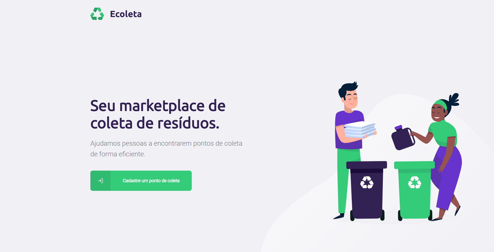
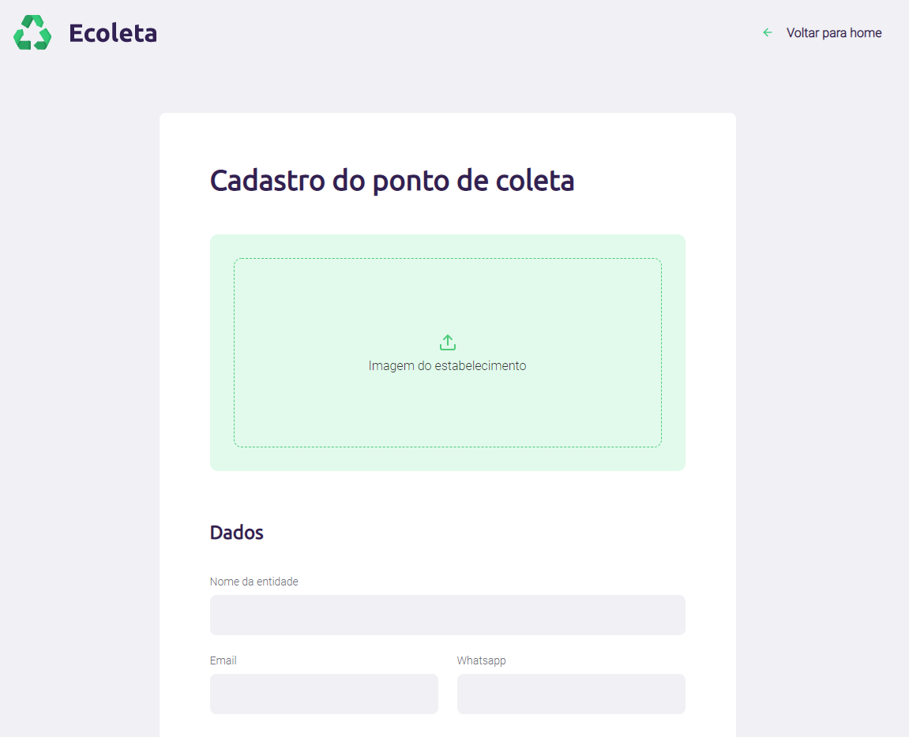
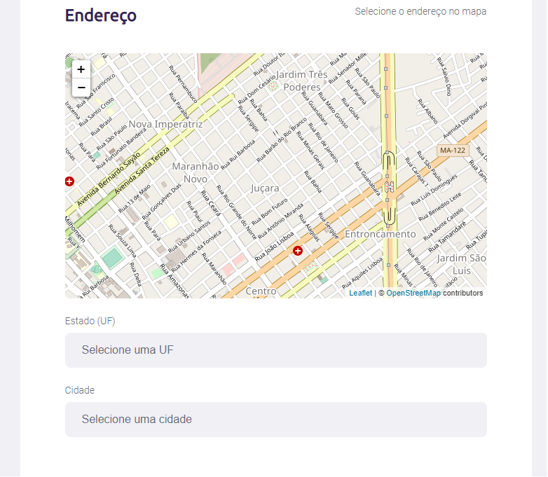
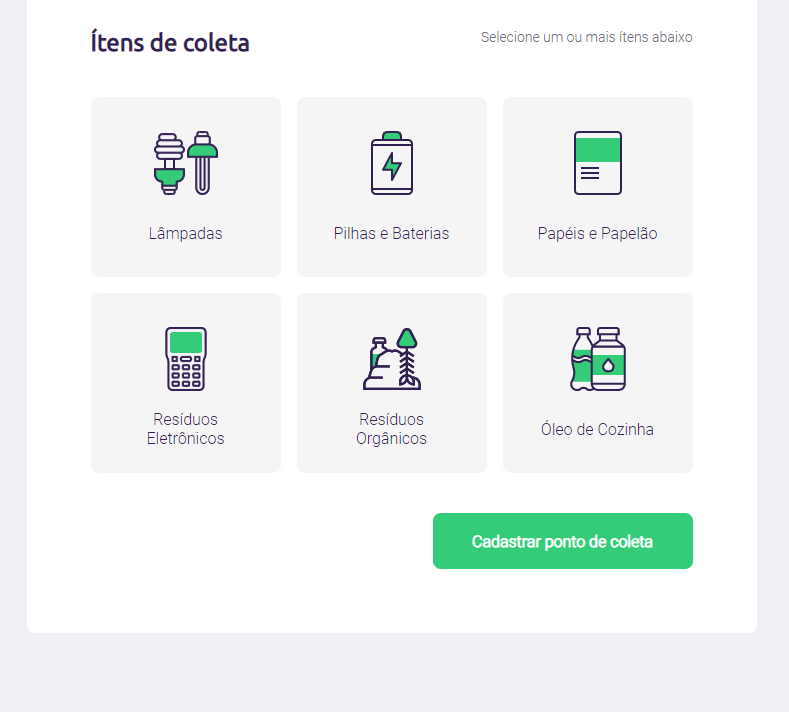
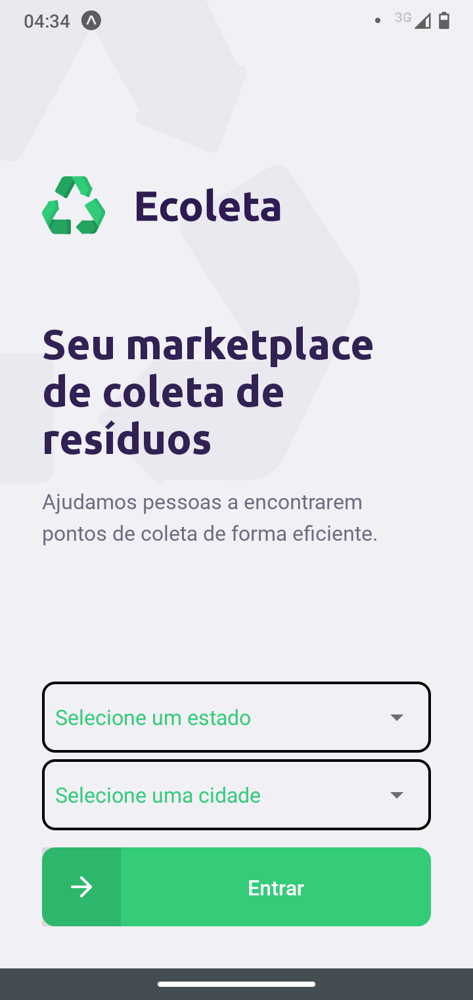
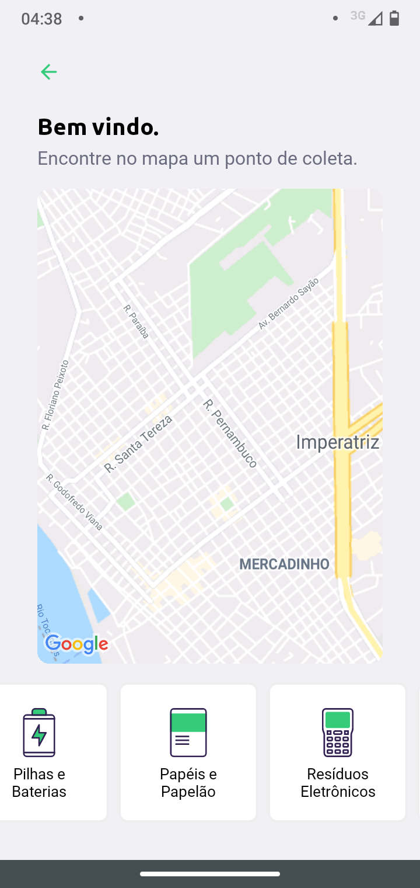

# NLW01 Ecoleta

Ecoleta Application developed on Next Level Week 01 by Rocketseat. 

## What's featured in this project?

- A RESTful-ish API using NodeJS, SQLite and Knex coded in Typescript.
- A web application to register places where people can deliver recyclabes. Made with ReactJS and bootstrapped by Create React App.
- A mobile application to search for the registered places. Made with React Native.

## Built with

* [Typescript](https://www.typescriptlang.org/)
* [NodeJS](https://nodejs.org/)
* [SQLite](https://www.sqlite.org/)
* [Knex](http://knexjs.org/)
* [ReactJS](https://reactjs.org/)
* [Create React App](https://create-react-app.dev/)
* [React Native](https://reactnative.dev/)
* [Expo](https://expo.io/)

<!-- TABLE OF CONTENTS -->
## Table of Contents

* [App Preview](#app-preview)
  * [Web](#web)
  * [Mobile](#mobile)
* [Getting Started](#getting-started)
  * [Prerequisites](#prerequisites)
  * [Installation](#installation)
* [License](#license)
* [Contact](#contact)

## App Preview
<p align="center" id="web">
  <strong>Web</strong>
</p>
<p align="center">
  
</p>
<p align="center">

</p>
<p align="center">

</p>
<p align="center">

</p>

<br/>
<p align="center" id="mobile">
  <strong>Mobile</strong>
</p>
<p align="center">
  
</p>
<p align="center">

</p>
<br/>

## Getting started

## Prerequisites

- NodeJS
- Expo, for mobile application

## Installation
On /server, /web, /mobile

```
npm install
```

### How to initialize the database?
On /server

```
npm install
npm run knex:migrate
npm run knex:seed
```

### How to start the api server?
On /server

```
npm run dev
```

### How to start the web application?
On /web

```
npm start
```

### How to start the mobile application?
On /mobile

```
npm start
```

## License

Distributed under the MIT License.

## Contact

Carlos Castro - contato-carloscastro@hotmail.com

Made with laziness and sorrow.
